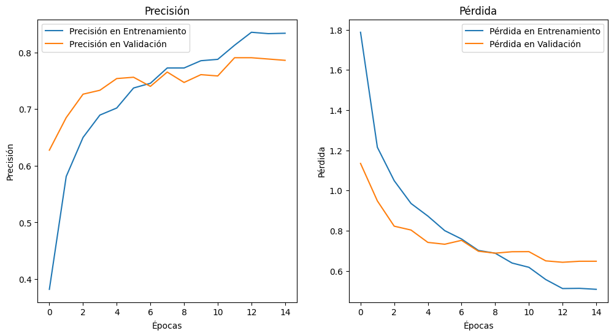
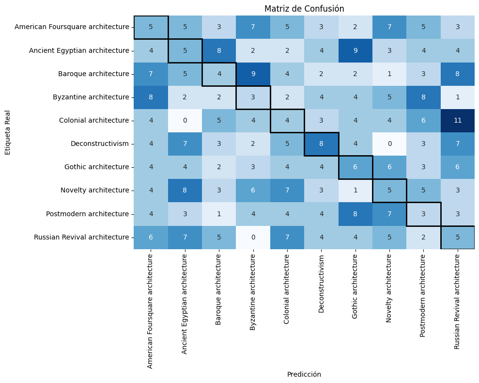

# Memoria Técnica

## Portada
- **Nombre del Proyecto**: Clasificación de Estilos Arquitectónicos 
- **Fecha**: 4 de diciembre de 2024.
- **Autor**:  
  - Sebastian García Rodríguez

## Índice
- [Portada](#portada)
- [Alcance del proyecto](#alcance-del-proyecto)
  - [Objetivo](#objetivo)
  - [Introducción](#introducción)
- [Fuentes de información y procedimientos aplicados](#fuentes-de-información-y-procedimientos-aplicados)
  - [Construcción del modelo](#construcción-del-modelo)
  - [Resultados modelo](#resultados-modelo)
  - [Pruebas sobre el modelo](#pruebas-sobre-el-modelo)
- [Conclusiones](#conclusiones)
- [Anexos](#anexos)

## Alcance del proyecto

### Objetivo
El objetivo de este proyecto es desarrollar un modelo de clasificación de imágenes que pueda identificar y categorizar con precisión 10 estilos arquitectónicos seleccionados a partir de un conjunto de datos de imágenes.

### Introducción

## Fuentes de información y procedimientos aplicados

Este proyecto utiliza un conjunto de datos compuesto por imágenes de 10 estilos arquitectónicos diferentes. Este conjunto de datos proviene de dos fuentes principales:
1. Imágenes extraídas de Google Images (g-images): Estas imágenes fueron recopiladas específicamente para este proyecto con el objetivo de cubrir una amplia gama de estilos arquitectónicos.
2. Conjunto de datos del artículo “Architectural Style Classification using Multinomial Latent Logistic Regression” (ECCV 2014): Este conjunto de datos fue creado por Zhe Xu y está disponible en Kaggle. El artículo original incluye 25 estilos arquitectónicos, pero en este proyecto solo se utilizan 10 clases específicas para la tarea de clasificación.

Las 10 clases seleccionadas son las siguientes:
* Ancient Egyptian architecture: 406 imágenes
* American Foursquare architecture: 362 imágenes
* Baroque architecture: 456 imágenes
* Byzantine architecture: 313 imágenes
* Colonial architecture: 480 imágenes
* Deconstructivism: 335 imágenes
* Gothic architecture: 331 imágenes
* Novelty architecture: 382 imágenes
* Postmodern architecture: 322 imágenes
* Russian Revival architecture: 352 imágenes

## Pipeline de Preparación

### 1. Descarga del Conjunto de datos

El conjunto de datos fue descargado desde Kaggle utilizando el comando:
```python
kagglehub.dataset_download('dumitrux/architectural-styles-dataset')
```
### 2. Definición de Directorios y Categorías

El directorio principal del conjunto de datos se encuentra en la siguiente ubicación:
```python
dataset_dir = '/root/.cache/kagglehub/datasets/dumitrux/architectural-styles-dataset/versions/3/architectural-styles-dataset'
```

Las categorías específicas seleccionadas para la clasificación de estilos arquitectónicos son:
```python
categories = [
    'American Foursquare architecture', 'Ancient Egyptian architecture',
    'Baroque architecture', 'Byzantine architecture', 'Colonial architecture',
    'Deconstructivism', 'Gothic architecture', 'Novelty architecture',
    'Postmodern architecture', 'Russian Revival architecture'
]
```
### 3. Creación de Directorios de Datos y División de Imágenes

El directorio data se crea y se dividen las imágenes en tres particiones: entrenamiento, validación y prueba. El proceso incluye:
* División de Datos: Los datos se dividen en 75% para entrenamiento, 15% para validación y 15% para prueba. Esto se realiza utilizando train_test_split de Scikit-learn.
* Organización de Directorios: Se crean subdirectorios para cada partición de datos y cada categoría, y las imágenes se mueven a los directorios correspondientes.

### 4. Distribución de Imágenes
Para asegurar un equilibrio en el número de imágenes por categoría, se limita el número de imágenes seleccionadas de cada clase a un valor objetivo. En este caso, se seleccionan hasta 350 imágenes por categoría. Si una categoría tiene menos imágenes, se utilizan todas las disponibles. Este paso ayuda a balancear las clases y evitar que el modelo favorezca las clases con más ejemplos.

El conjunto de datos final consta de las siguientes cantidades de imágenes en cada partición:
* Conjunto de Entrenamiento: 2,886 imágenes distribuidas entre las 10 clases.
* Conjunto de Validación: 435 imágenes distribuidas entre las 10 clases.
* Conjunto de Prueba: 80 imágenes distribuidas entre las 10 clases.

### 5. Preprocesamiento

Las imágenes son preprocesadas mediante los siguientes pasos:
* Redimensionamiento: Las imágenes se redimensionan a un tamaño uniforme de 224x224 píxeles, que es el tamaño de entrada requerido para modelos preentrenados como VGG16.
* Escalado de Imágenes: Los valores de los píxeles se normalizan en el rango [0, 1] para mejorar la convergencia del modelo.

### 6. Manejo de desequilibrio entre clases

Dado que algunas clases tienen más imágenes que otras, se calcula un peso para cada clase que equilibrará su influencia durante el entrenamiento. Este enfoque ayuda a evitar que el modelo favorezca las clases con más ejemplos, asegurando una clasificación más equilibrada.
```python
class_weights = compute_class_weight(
    'balanced', 
    classes=np.unique(train_generator.classes), 
    y=train_generator.classes
)
```


## Construcción del modelo

El código implementa un modelo de clasificación de imágenes utilizando una red neuronal convolucional (CNN) basada en VGG16. En este caso, el objetivo es clasificar imágenes de arquitectura en diferentes estilos. Las CNNs son muy eficaces para extraer características espaciales de las imágenes, como bordes, texturas y patrones complejos, lo que las hace adecuadas para el análisis visual de edificios y estructuras arquitectónicas.


### Aquitectura

| **Layer (type)**           | **Output Shape**         | **Param #** |
|----------------------------|--------------------------|-------------|
| `input_1 (InputLayer)`     | (None, 224, 224, 3)     | 0           |
| `vgg16 (Functional)`          | (None, 7, 7, 512)    | 14,714,688 |
| `flatten (Flatten)` | (None, 25088)    | 0          |
| `dense (Dense)`        | (None, 256)    | 6,422,784       |
| `dropout (Dropout)` | (None, 256)     | 0           |
| `dense_1 (Dense)`          | (None, 10)               | 2,570        |

* Total params: 59,949,152 (228.69 MB)
* Trainable params: 19,404,554 (74.02 MB)
* Non-trainable params: 1,735,488 (6.62 MB)
* Optimizer params: 38,809,110 (148.05 MB)
* 
### Funcionamiento del Modelo
1. Capa de entrada: La imagen de entrada se redimensiona a 224x224 píxeles y se normaliza para que los valores de los píxeles estén en el rango [0, 1].
2. Base VGG16: Se utiliza la arquitectura preentrenada de VGG16 sin las capas finales completamente conectadas. Esta base extrae características importantes de las imágenes (bordes, texturas, formas).
3. Capa Flatten: Aplana la salida 3D de VGG16 en un vector 1D, lo que permite que las capas densas posteriores realicen la clasificación.
4. Capas densas: La primera capa densa con 256 unidades y activación ReLU permite que el modelo aprenda representaciones más abstractas de las características extraídas. La capa de Dropout con una probabilidad del 50% ayuda a prevenir el sobreajuste.
5. Capa de salida: La capa de salida tiene 10 unidades (una por cada estilo arquitectónico) y utiliza una función de activación softmax, lo que permite que el modelo haga clasificación multiclase.


### Justificación 

Esta red es adecuada para la tarea de clasificación de estilos arquitectónicos porque:
* Extrae características relevantes de las imágenes mediante el uso de VGG16, una red preentrenada muy eficaz en tareas de visión por computadora.
* Se adapta bien a la clasificación multiclase gracias a la capa de salida con activación softmax.
* * Es flexible y escalable, permitiendo ajustes en las capas finales para mejorar el rendimiento según los requerimientos específicos del problema.

## Resultados modelo

El modelo no muestra signos claros de sobreajuste, ya que las métricas de validación son similares a las de entrenamiento.



### **Precisión (Accuracy)**:
Entrenamiento: La precisión alcanza valores cercanos a 70% rápidamente, indicando un ajuste aceptable a los datos de entrenamiento.

Validación: La precisión en el conjunto de validación muestra un desempeño aceptable, alcanzando un valor cercano al 70-80%. Sin embargo, a medida que avanzan las épocas, esta métrica se estabiliza y no experimenta mejoras significativas,

### **Pérdida (Loss)**:
Entrenamiento: La pérdida disminuye consistentemente y se estabiliza en valores bajos (~0.3), lo que refleja que el modelo está aprendiendo adecuadamente.

Validación: La pérdida de validación se mantiene baja, pero comienza a estabilizarse en valores ligeramente elevados, en el rango de 0.6, a partir de la mitad del entrenamiento. Esto indica que el modelo podría beneficiarse de la implementación de técnicas adicionales de regularización para mejorar la estabilidad.

## Pruebas sobre el modelo

### **Matriz de Confusión**


## Conclusiones

El modelo desarrollado para la clasificación de estilos arquitectónicos ha mostrado un rendimiento razonable, con una precisión de alrededor del 75-85% en los conjuntos de entrenamiento y validación. Sin embargo, la matriz de confusión indica que hay áreas significativas en las que el modelo necesita mejorar. En particular, se observan confusiones entre ciertas clases que podrían estar relacionadas con similitudes visuales entre los estilos arquitectónicos o con la falta de datos representativos para algunas clases específicas.

A pesar de que el modelo no presenta signos claros de sobreajuste, la estabilidad de la pérdida de validación y su falta de mejoras significativas durante las últimas épocas sugieren que se podría optimizar aún más el modelo.

Algunas estrategias que podrían mejorar el desempeño incluyen:
1. Ajustes en la arquitectura: Experimentar con otras configuraciones de redes neuronales o incluso con otras arquitecturas preentrenadas podría mejorar la capacidad del modelo para extraer características más claras de las imágenes.
2. Regularización adicional: Técnicas como la normalización de lotes (batch normalization) o el uso de más capas de dropout podrían ayudar a mejorar la generalización del modelo.
3. Ampliación de datos: Incrementar la cantidad de datos, especialmente para clases con menos ejemplos, podría ser beneficioso.

El modelo presenta una base sólida para la clasificación de estilos arquitectónicos, es evidente que necesita más ajustes y refinamientos para mejorar su rendimiento, particularmente en términos de precisión en la clasificación de clases más difíciles de diferenciar.

## Anexos
- [Repositorio Github](https://github.com/SebastianGR-FC/Clasificacion-de-Estilos-Arquitectonicos)
- [Conjunto de Datos para la Clasificación de Estilos Arquitectónicos en Kaggle](https://www.kaggle.com/datasets/dumitrux/architectural-styles-dataset)
